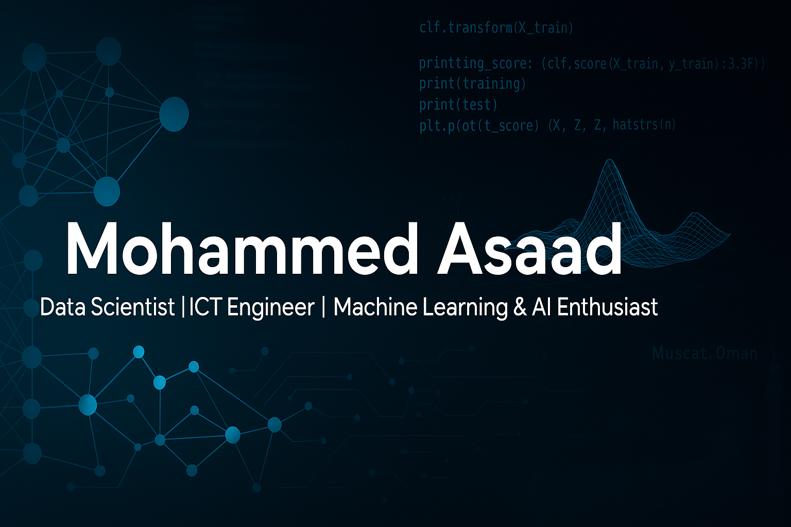

<h1 align="center">Hi 👋, I'm Mohammed Asaad</h1>
<h3 align="center">Fresh Data Scientist | ICT Engineer | Machine Learning & AI Enthusiast</h3>

<strong>Turning data into impactful insights — one model at a time.</strong>

  
  
  
  
  
  

  
  
  
  
  
  

---

<h2>💬 Welcome to my Profile!</h2>

  

---

## 📍 About Me

- 🎓 B.Sc. in ICT Engineering – University of Tartus (Graduated: September 2024)  
- 🌍 Based in Muscat, Oman  
- 🧠 Passionate and detail-oriented data scientist skilled in ML pipelines, deep learning, and data analytics. I enjoy building practical models that solve real-world problems.

---

## ⚙️ Technical Skills

- **Languages:** Python, SQL  
- **Libraries:** NumPy, Pandas, Matplotlib, Seaborn, Scikit-learn  
- **Deep Learning:** TensorFlow, Keras, PyTorch  
- **Tools:** Jupyter, Google Colab, Git, GitHub  
- **Deployment:** Flask, FastAPI, Docker, Streamlit  
- **Cloud:** AWS (basic)

---

## 🚀 Featured Projects

| Project | Description | Tech Stack |
|--------|-------------|------------|
| 🔹 [Google Stock Prediction](https://github.com/Mohammed-asaad-AI/Google-Stock-Price-Prediction) | Stock forecasting using ML models with visual analytics. | Python, Scikit-learn, Pandas |
| 🔹 [Breast Cancer Prediction](https://github.com/Mohammed-asaad-AI/Breast-Cancer-Prediction) | Manual KNN vs sklearn KNN on diagnosis data. | Python, NumPy, Scikit-learn |
| 🔹 [KMeans Titanic Clustering](https://github.com/Mohammed-asaad-AI/KMeans-Clustering-Project) | Unsupervised learning with PCA & survival analysis. | Pandas, Seaborn, Scikit-learn |
| 🔹 [Personal Portfolio Website](https://github.com/Mohammed-asaad-AI/My-Website) | Responsive AI & Cloud portfolio website using Flask, deployed on Azure. | HTML, CSS, JavaScript, Flask, Azure |

---

## 📈 GitHub Stats

  
   
  

 

  

---

## 💼 Professional Tools

  
  
  
  
  
  
  
  
  
  

## ☁️ Cloud & DevOps Stack

  
  
  
  
  
  

---
## 💡 What I'm Currently Working On

- 🚀 Building a cloud-based portfolio website with Flask & Azure (now live!)
- ☁️ Learning advanced Azure services: App Services, Blob Storage, and CI/CD via GitHub Actions
- 🔄 Dockerizing ML apps for faster and reproducible deployment
- 📊 Developing a real-time analytics dashboard using Streamlit + Azure Functions
- 🧠 Experimenting with HuggingFace Transformers for NLP classification tasks
- 📘 Preparing for Microsoft Azure Fundamentals (AZ-900) certification

---

## 📚 Recommended Learning

- [Andrew Ng ML Course (Coursera)](https://www.coursera.org/learn/machine-learning)  
- [Hands-On ML with Scikit-Learn & TF](https://www.oreilly.com/library/view/hands-on-machine-learning/)  
- [Kaggle Micro-Courses](https://www.kaggle.com/learn)

---

## 🏅 Certifications

- 🧠 ML & Deep Learning – Advanced  
- 🔰 Python & Data Analysis – Foundation  
- 📊 Kaggle: [@mohammedasaad7](https://www.kaggle.com/mohammedasaad7)

---

## 📫 Connect with Me

  
  
  
  

---

## ⚡ Fun Fact

<blockquote>
"Discipline is the silent force that builds your dreams brick by brick. Stay consistent, stay focused — and the impossible will soon be your reality."
</blockquote>
